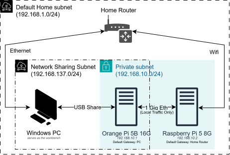

# Nodeunta

A distributed system framework that divides tasks on multiple nodes (in my test setup currently 2 nodes.)

## Current Setup



It is a mess honestly, and I really do not care.

Orignally I wanted to see how Windows ICS worked with OPI5b, so I connected it via USB Sharing. Then thought I could make a distributed system with it and the RPI5 I have been hoarding.

So the setup became this. I wanted to access the RPI via ssh easily from my PC, so the wifi remains UP on it.

iperf3 speed results from the 1 gig connection:

```console
user@opi5:~$ iperf3 -s
-----------------------------------------------------------
Server listening on 5201 (test #1)
-----------------------------------------------------------
Accepted connection from 192.168.10.2, port 51382
[  5] local 192.168.10.1 port 5201 connected to 192.168.10.2 port 51398
[ ID] Interval           Transfer     Bitrate
[  5]   0.00-1.00   sec   112 MBytes   935 Mbits/sec
[  5]   1.00-2.00   sec   112 MBytes   936 Mbits/sec
[  5]   2.00-3.00   sec   112 MBytes   936 Mbits/sec
[  5]   3.00-4.00   sec   112 MBytes   936 Mbits/sec
[  5]   4.00-5.00   sec   112 MBytes   936 Mbits/sec
[  5]   5.00-6.00   sec   112 MBytes   936 Mbits/sec
[  5]   6.00-7.00   sec   112 MBytes   936 Mbits/sec
[  5]   7.00-8.00   sec   112 MBytes   936 Mbits/sec
[  5]   8.00-9.00   sec   112 MBytes   936 Mbits/sec
[  5]   9.00-10.00  sec   112 MBytes   937 Mbits/sec
[  5]  10.00-10.00  sec   256 KBytes   921 Mbits/sec
- - - - - - - - - - - - - - - - - - - - - - - - -
[ ID] Interval           Transfer     Bitrate
[  5]   0.00-10.00  sec  1.09 GBytes   936 Mbits/sec                  receiver
user@opi5:~$ ping 192.168.10.2
PING 192.168.10.2 (192.168.10.2) 56(84) bytes of data.
64 bytes from 192.168.10.2: icmp_seq=1 ttl=64 time=0.309 ms
64 bytes from 192.168.10.2: icmp_seq=2 ttl=64 time=0.320 ms
64 bytes from 192.168.10.2: icmp_seq=3 ttl=64 time=0.292 ms
64 bytes from 192.168.10.2: icmp_seq=4 ttl=64 time=0.309 ms
--- 192.168.10.2 ping statistics ---
4 packets transmitted, 4 received, 0% packet loss, time 3034ms
rtt min/avg/max/mdev = 0.292/0.307/0.320/0.010 ms

```

## Todo

1. Make the eventually consistent LWW File sync system.
2. Figure out how to discover nodes in a given subnet. 
	- Using UDP, find all active nodes 
3. Send tasks to different systems.
	- Use the Broadcast address to send a task to every node in the subnet
	- Have them reply to make them available for a new job withing a time limit.
4. Make a job Queue and task partitioning system.
5. Pipeout outputs and at the least implement CTRL+C to stop any running program.

## FAQ

> What happens if something drops?

It wont.

> Does this solve anything?

No, It does not solve anything.

> Is it better than anything in the market?

No.

> What is the actual use case?

## LICENSE

aGPLv3
